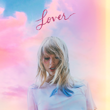

# Taylor Swift Eras
### **Who is Taylor Swift?**
> ##### *Taylor Swift is an American snger-songwriter who created over 200+ songs and 12 albums (Including the Taylor's version (Fearless/Red)). She was born in 1989 and had her first album (debut) in year 2006 (US and Canada) and internationally in year 2008.*
### What is an Era?
> ##### *A phase or a time in our lives where we experience different kind of things. Times where we feel happy, sad, hearbroken, glad, proud, etc.*

### Taylor Swift's Ten Eras
> 
1. [Taylor Swift (Debut)](https://open.spotify.com/album/5eyZZoQEFQWRHkV2xgAeBw?si=U2nHRIQmQpK_bijv7AEpxw)
> 
2. [Fearless](https://open.spotify.com/album/4hDok0OAJd57SGIT8xuWJH?si=bE-oG8k1R1G9XxWlf54Q8w)
> 
3. [Speak Now](https://open.spotify.com/album/6Ar2o9KCqcyYF9J0aQP3au?si=vpM3fWPiTB20g_oYtQHIbw)
> 
4. [Red](https://open.spotify.com/album/1KVKqWeRuXsJDLTW0VuD29?si=kl-48DiOR4ygtwiWChb4ag)
> 
5. [1989](https://youtube.com/playlist?list=OLAK5uy_lglIKPOFCG5X9_Rf4Hxsmmh9GEeHL94Jo)
> 
6. [Reputation](https://youtube.com/playlist?list=OLAK5uy_kyYsExXByLh2281MMfi0QvZJF5epEUxbk)
> 
7. [Lover](https://youtube.com/playlist?list=PLINj2JJM1jxObDqF8VXonjQhrBnnMrtGH)
> 
8. [Folklore](https://youtube.com/playlist?list=PLINj2JJM1jxNNBnGb3WvHmcyCyfl0VlJX)
> 
9. [Evermore](https://youtube.com/playlist?list=PLINj2JJM1jxP3taLik1NA6CFs5L-TD7uw)
> 
10. [Midnights](https://youtube.com/playlist?list=PLINj2JJM1jxP5aYiX47uBCRu9g8JItDWp)

### **Taylor's Version Album**
>
- [Fearless (Taylor's Version)](https://open.spotify.com/album/4hDok0OAJd57SGIT8xuWJH?si=LNe6_RX9QbmQhp-UP1YR8A)
>
- [Red (Taylor's Version)](https://open.spotify.com/album/6kZ42qRrzov54LcAk4onW9?si=hfzEj295TBWDbFPMcnF0DQ)

## **Reference:**
- [Taylor Swift](https://en.wikipedia.org/wiki/Taylor_Swift)
- [YouTube](https://www.youtube.com/)
- [Spotify](https://open.spotify.com/)

	
